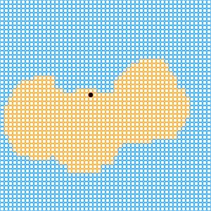
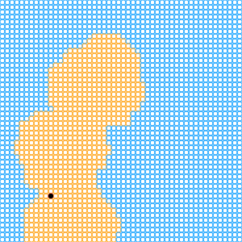
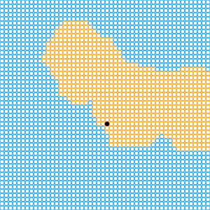
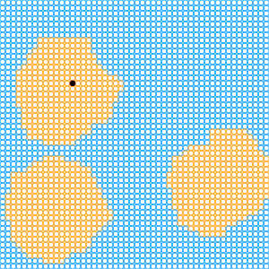

**随机不规则的2d地图**

这个方法的**整体版块大小和内部的黄色区域大小,数量以及分布都可以轻松调节**

并且不限于正方形

虽然很多点都用的随机数，但是依然可以自定义地图

所有的地图信息都以字符串形式存储在localstorage中

键值mapR和mapL存储了地图的列数和行数

当然，**这是我在没有找到合适的地图随机方法的情况下才自己想出来的办法**

如果有什么更好的方法，请务必告知我

PS：图中的黑点是“游戏”的其他部分

